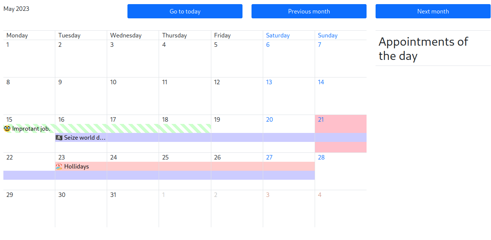

# Simple month event calendar (for boostrap 5)
It is a simple month calendar based on boostrap 5 and this calendar can display events. 




## Demo

[Simple demo](https://raw.githack.com/docmcfly/boostrap5EventCalendar/main/docs/demo/index.html)

## Instructions

1. Import the important script sources
```html
<!-- imports boostrap 5 -->
<script 
    src="https://cdn.jsdelivr.net/npm/bootstrap@5.0.2/dist/js/bootstrap.bundle.min.js"
    integrity="sha384-MrcW6ZMFYlzcLA8Nl+NtUVF0sA7MsXsP1UyJoMp4YLEuNSfAP+JcXn/tWtIaxVXM"
    crossorigin="anonymous">
</script>
<!-- imports jquery -->
<script 
    src="https://cdn.jsdelivr.net/npm/jquery@3.7.0/dist/jquery.min.js" integrity="sha256-2Pmvv0kuTBOenSvLm6bvfBSSHrUJ+3A7x6P5Ebd07/g=" crossorigin="anonymous">
</script>
<!-- imports calendar.js -->
<script 
    src="../../javascript/src/calendar.js">
</script>
```

2. Create the target &lt;div>-tag

```html
<div id="calendar" defer="defer">Calendar</div>
```

3. Render the calendar
   
```js
 new Calendar('#calendar', 'en', {}).renderCalendar([]);
```
#### Parameter:
* "#calendar"  is the &lt;div> tag selector
* "en" is the language (Currently english and german are supported.)
* "{}" can contains additional properties. (by example: you can add a new language or you can change colors.) 
* "[]" is an array with your events. 

### Here is a greater example

```js
 new Calendar('#calendar', 'en', {
      todayBgColor: 'pink', // today color is pink
      texts: {
        en: {
          btnToday: 'Go to today' // change the button text of today
        }
      }
    }).renderCalendar([
      {
        start: '2023-05-23T11:10', // start time of the event
        end: '2023-05-27T17:30',// end time of the event
        title: '🏖️ Hollidays', // the title of the event
        backgroundColor: '#ffcccc',// the background color
      },
      {
        start: '2023-05-15T00:00',
        end: '2023-05-19T00:00',
        title: '🥸 Improtant job.',
        backgroundColor: '#ccffcc',
        striped: true,
      },
      {
        start: '2023-05-16',
        end: '2023-05-27T17:30',
        title: '🏴‍☠️ Seize world domination',
        backgroundColor: '#ccccff',
      },
    ]);
```
